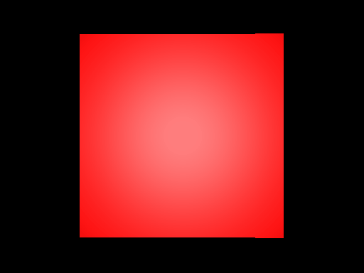

# OpenGL Renderer

<p align="center">
  
</p>


## Features

* Supports Diffuse textures.
* Features a Phong shader and a post-processing shader.
* Custom Resolutions.

### Usage

```cpp
int main() {
 	
    GLFWwindow *window;

    if (!glfwInit()) {
        return -1;
    }

    window = glfwCreateWindow(1280, 720, "HelloWorld", nullptr, nullptr);

    if (!window) {
        glfwTerminate();
        return -1;
    }

    glfwMakeContextCurrent(window);
    glfwSwapInterval(1);

    if (glewInit()!=GLEW_OK)
        std::cout << "Error" << std::endl;

    glEnable(GL_DEBUG_OUTPUT);

    std::cout << glGetString(GL_VERSION) << std::endl;

    glBlendFunc(GL_SRC_ALPHA, GL_ONE_MINUS_SRC_ALPHA);
    glEnable(GL_BLEND);
    glEnable(GL_CULL_FACE);
    
    float attributes[] = {
        1.0f, -1.0f, 1.0f, 0.0f, // x,y,u,v
        -1.0f, -1.0f, 0.0f, 0.0f,
        -1.0f, 1.0f, 0.0f, 1.0f,

        1.0f, 1.0f, 1.0f, 1.0f,
        1.0f, -1.0f, 1.0f, 0.0f,
        -1.0f, 1.0f, 0.0f, 1.0f,
    }; // define vertex attributes

    unsigned int indices[] = {
        0, 2, 1,
        3, 5, 4
    };  // define indices

    VArray va; // create vertex array
    VBuffer vb(attributes, 6*4*sizeof(float)); // create vertex buffer
    VBLayout layout; 
    layout.Push<float>(2); // x,y
    layout.Push<float>(2); // u,v
    va.AddBuffer(vb, layout); // add layout to va

    IBuffer ib(indices, 6); // create index buffer

    auto mCameraPos = glm::translate(glm::mat4(1.0f), glm::vec3{0, 0, 2}); // set camera position
    auto mView = glm::inverse(mCameraPos);	// calculate view matrix
    auto mProjection = glm::perspective(45.0f, (float) WIDTH/HEIGHT, 0.1f, 100.0f); // construct projection matrix


    auto modelTranslation = glm::translate(glm::mat4(1.0f), glm::vec3{0,0,0});
    auto modelRotation = glm::rotate(glm::mat4(1.0f), 0.0f, glm::vec3(0, 1, 0));
    auto modelScaling = glm::scale(glm::mat4(1.0f), glm::vec3(1, 1, 1));

    auto model = modelTranslation*modelRotation*modelScaling; // create model matrix

    auto mNormalMat = glm::determinant(model)*glm::transpose(glm::inverse(model)); // create normal matrix
    auto mModelView = mView*model; // construct mv matrix

    LightSource defaultLight{glm::vec3(0, 0, 0.0f)}; // create a light source

    Shader shader("resources/shaders/Phong.shader"); // create shader
    shader.Bind();

    Renderer renderer; // renderer object

    while (!glfwWindowShouldClose(window)) {
        renderer.Clear(); // calls glClear(...)

        shader.Bind();
        
        // set uniforms
        shader.setUniformMat4f("uProjection", mProjection);
        shader.setUniformMat4f("uModelView", mModelView);
        shader.setUniformMat4f("uNormalMat", mNormalMat);
        shader.SetUniformVec3("uLightPos", defaultLight.Position());

        renderer.Draw(va, ib, shader); // issue draw call

        glfwSwapBuffers(window); // present window

        glfwPollEvents();
    }
    
    glfwTerminate(); // shutdown
}
```